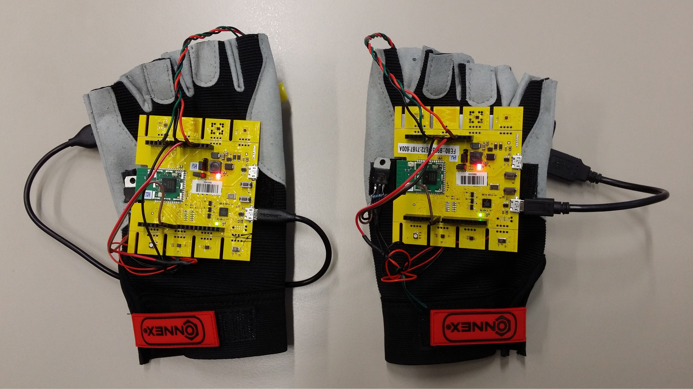

IoT-Glove
-------------------------------------------------------------------------------
Glove to send and receive signals via a gateway

This code is meant for students that need a working example of how to implement CoAP on a node that uses Riot. I can not garanty that this code is up to date or the best way to do it.

Tags: RIOT-OS, CoAP, OSC, 6LoWPAN, raspberrypi, python3, c++, aiocoap, microcoap

Autor: Sebastian Wilkes 
Project: AudioGames, HAW Hamburg
Semester: SS 2016

**Description:**

Within the AudioGames project in 2016 there was the need to make the player feel a crash with a virtual object. Another requirement was to be able to send signals via buttons. So I developed gloves with buttons and vibration modules that are able to communicate with a raspberrypi gateway using the CoAP Protocoll over the wireless 802.15.4 Network (6LowPAN). The raspberrypi should also be connected to the LAN and receives and sends data via the OSC-Protocoll (in this case). On the sensor nodes I used RIOT-OS which made it fun to use all sorts of libraries and made hardware access very easy. Thanks to the RIOT team in hamburg for their help!

**Crash scenario:**

**Communication:**

**Further information:**

- CoAP: http://coap.technology/
- RIOT: https://github.com/RIOT-OS/RIOT/wiki
- Instruction to install Raspian and WPAN: https://github.com/RIOT-Makers/wpan-raspbian
- Ping Pong example between RasPi and RIOT: https://github.com/smartuni/examples
- CoAP example using RIOT: https://github.com/smartuni/GirlsDay2016

